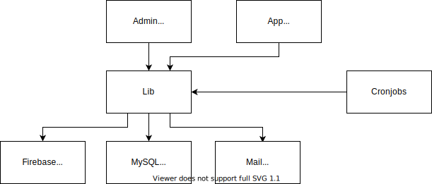

# Dokumentation

WOCS ist ein Onlineserver für die bereitstellung von App Inhalten.
Basiert auf PHP. 

## Admin Interface

Nicht mobil optimiert

HTML

## App Interface

JSON,

keine Admin funktionen

## Cronjobs
